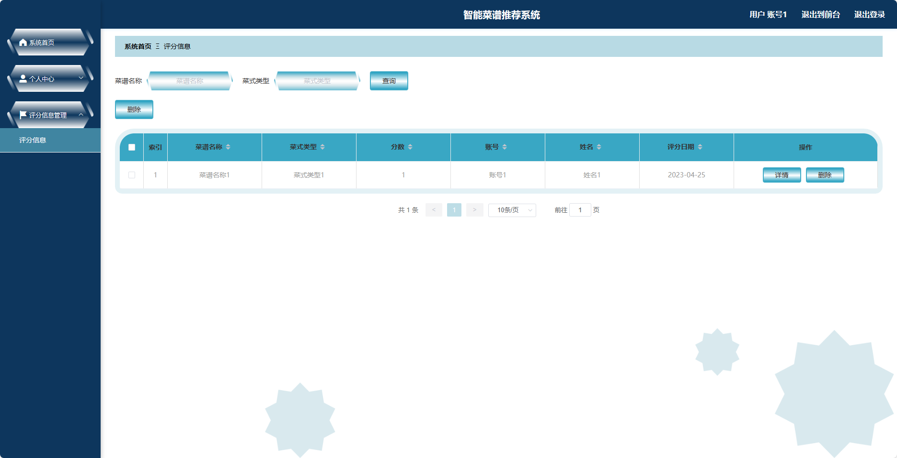
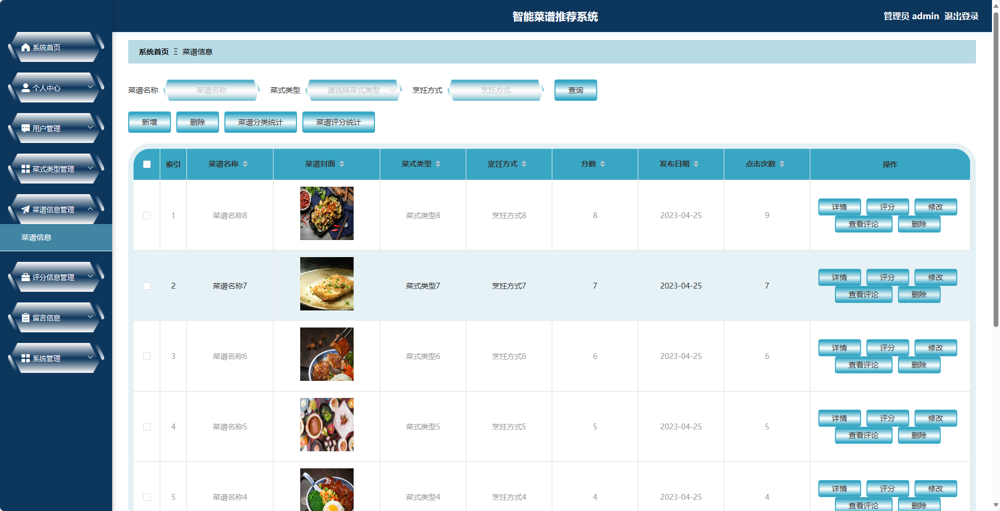

## 基于SpringBoot的智能菜谱推荐系统(程序+报告)

- <b>完整代码获取地址：从戎源码网 ([https://armycodes.com/](https://armycodes.com/))</b>
- <b>技术探讨、资料分享，请加QQ群：692619798</b> 
- <b>作者微信：19941326836  QQ：952045282</b> 
- <b>承接计算机毕业设计、Java毕业设计、Python毕业设计、深度学习、机器学习</b>
- <b>选题+开题报告+任务书+程序定制+安装调试+论文+答辩ppt 一条龙服务</b>
- <b>所有选题地址 ([https://github.com/YuLin-Coder/AllProjectCatalog](https://github.com/YuLin-Coder/AllProjectCatalog)) </b>

## 项目介绍
基于SpringBoot的智能菜谱推荐系统，系统包含两种角色：管理员、用户,系统分为前台和后台两大模块，主要功能如下。

### 【管理员】:
- 个人中心：管理员可以管理个人信息，修改密码等。
- 用户管理：管理员可以管理用户信息，包括添加、编辑和删除用户信息。
- 菜式类型管理：管理员可以管理菜式的分类信息，包括添加、编辑和删除分类。
- 菜谱信息管理：管理员可以管理菜谱的信息，包括添加、编辑和删除菜谱。
- 评分信息管理：管理员可以管理用户对菜谱的评分信息，包括查看和删除评分。
- 留言信息：管理员可以管理留言和评论，包括删除不当内容。
- 系统管理：管理员可以管理系统的相关配置，包括日志管理、权限管理等。

### 【用户】:
- 个人中心：用户可以管理个人信息，包括修改密码、查看评分历史等。
- 评分信息管理：用户可以对菜谱进行评分。

### 【前台】:
- 首页：展示平台的最新动态、推荐菜谱等内容。
- 菜谱信息：用户可以浏览各类菜谱。
- 公告信息：展示平台发布的公告和通知信息。
- 留言信息：用户可以在留言板上进行留言和评论。
- 个人中心：用户可以管理个人信息，包括修改密码、查看收藏的菜谱等。

## 项目技术
- 编程语言：Java
- 数据库：MySQL
- 项目管理工具：Maven
- 前端技术：HTML、CSS、JavaScript、Jquery、Vue
- 后端技术：Spring、SpringMVC、MyBatis

## 运行环境
- JDK版本：JDK1.8及以上
- 开发工具：IDEA、Ecplise、Myecplise都可以
- 数据库: MySQL5.7及以上
- Maven：maven3.0及以上
- Node：14.14.0及以上

## 运行截图

